

# Отчет

## Практическая работа №6

## Отладка приложений. Использование Logcat и таймеров

**Выполнил:**  
Ржевский Константин Романович
**Курс:** 2  
**Группа:** ИНС-б-о-24-1

**Проверил:**   
Потапов И.Р. 

---

### Цель работы

Изучить инструменты отладки Android-приложений. Научиться использовать Logcat для логирования сообщений различных уровней, а также применять таймеры (Timer, Chronometer) для выполнения отсроченных и периодических задач.

### Ход работы
1. Создадим новый проект с шаблоном Empty Views Activity. Назовём проект DebuggingLab.
В методе onCreate() добавим несколько сообщений с разными уровнями логирования.
Запустим приложение. Откроем окно Logcat, и найдём свои сообщения с помощью фильтрации.

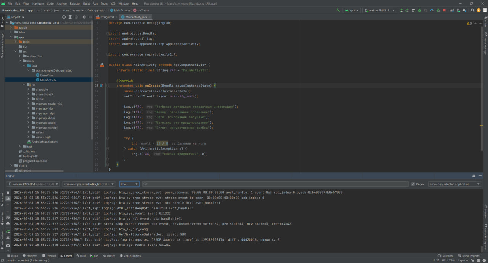

*Рисунок 1. Окно Logcat с информацией*

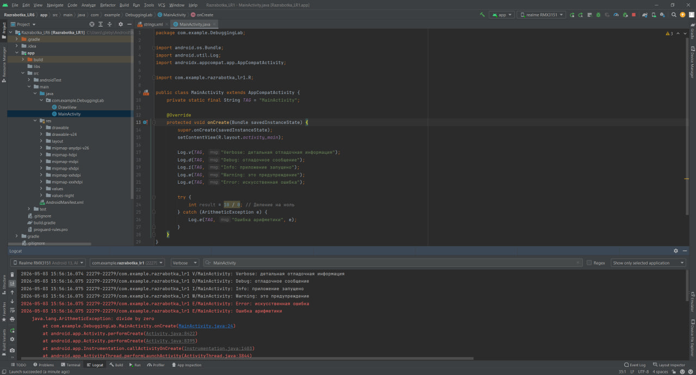

*Рисунок 2. Окно Logcat с информацией По тегу MainActivity*

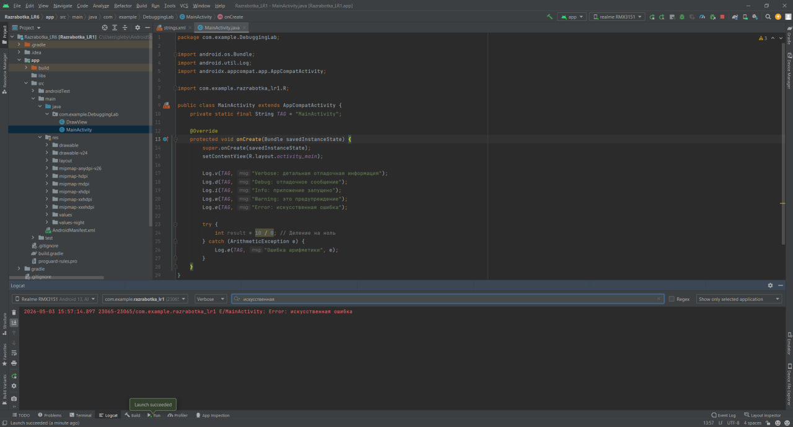

*Рисунок 3. Окно Logcat с информацией по поиску текста ("искусственная")*

2. Установим точку останова на строке с Log.d(TAG, "Debug: отладочное сообщение");
Запустим приложение в режиме отладки (нажмите на зелёного жучка Debug 'app'), и проделаем пункты:   
   - Step Over (F8) для выполнения текущей строки и перехода к следующей.
   - Изучим панель Variables, чтобы увидеть значения переменных (пока их нет, но принцип понятен).
   - Нажмём Resume Program (F9), чтобы продолжить выполнение.

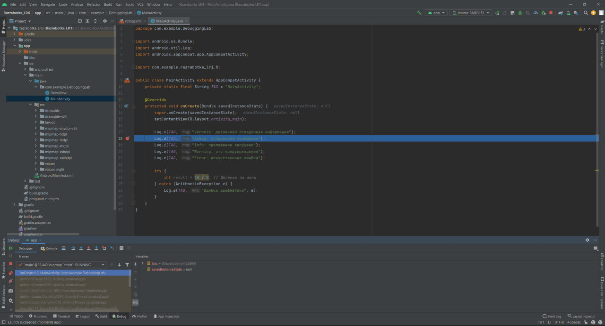

*Рисунок 4. Установка точки останова на строке с Log.d(TAG, "Debug: отладочное сообщение") и запуск в режиме отладки*

 

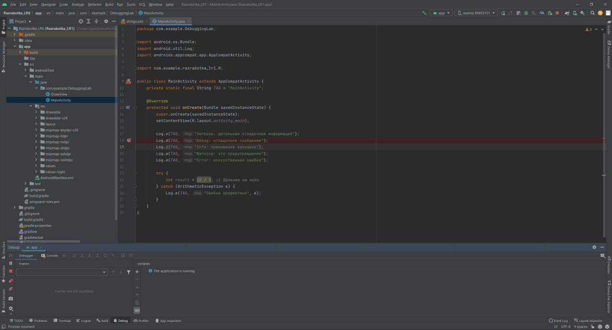

*Рисунок 5. Изучение панели Variables и выполенение продолжения*

 

3.  Модифицируем activity_main.xml. Добавим TextView с id tvTimer для отображения результата и кнопку для запуска таймера.
После, В MainActivity.java реализуем запуск таймера, который через 5 секунд изменит текст в TextView.

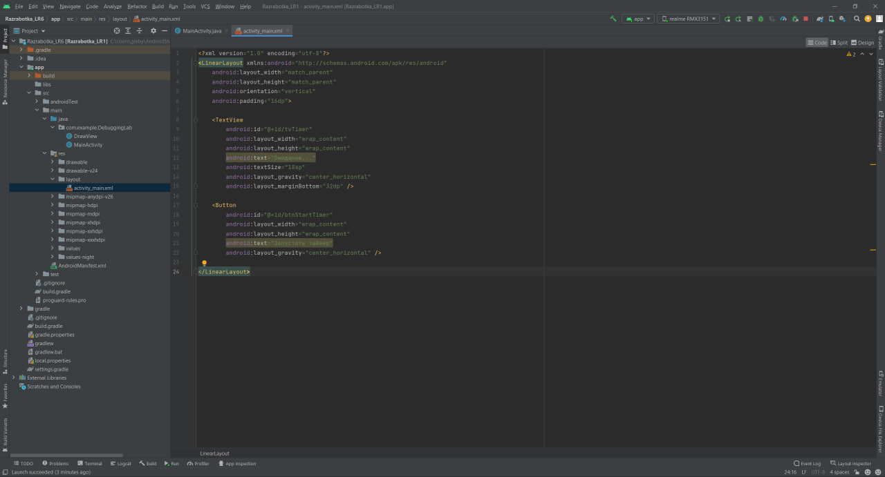

*Рисунок 6. Код activity_main.xml*

 

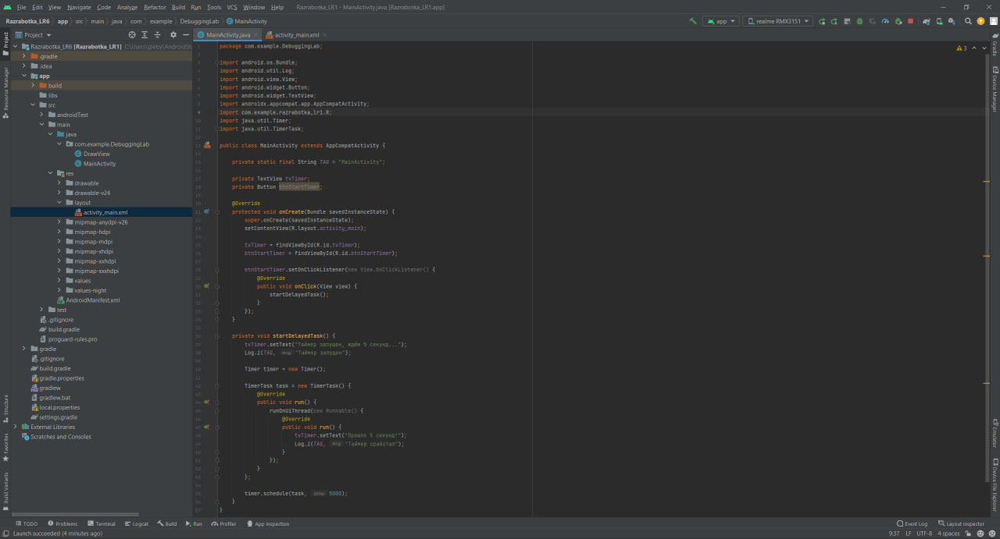

*Рисунок 7. Код MainActivity.java*

 

*Рисунок 7. Запуск приложения*

 

*Рисунок 8. Результат таймера в приложении*

 

4. Добавим в проект новую Empty Activity. Назовите её StopwatchActivity.
В activity_stopwatch.xml создадим интерфейс секундомера.
В MainActivity добавим вторую кнопку для перехода к секундомеру.
Также реализуем логику StopwatchActivity.java:

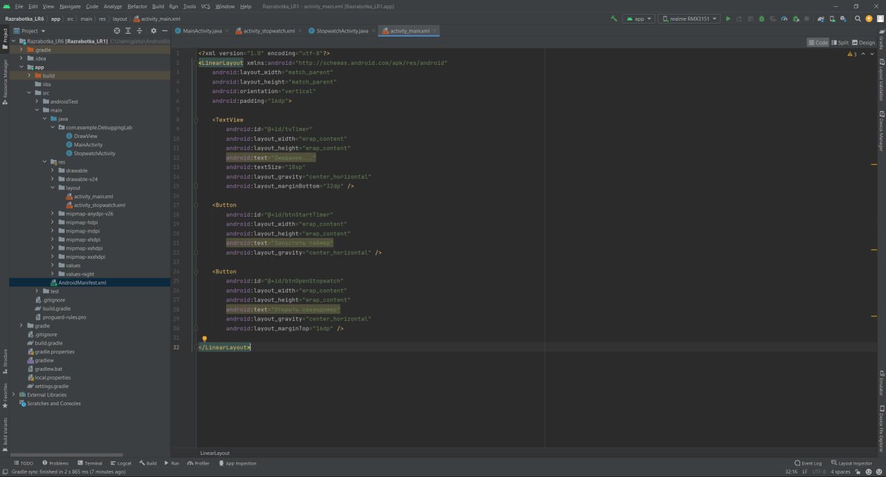

*Рисунок 9. Код activity_main.xml с добавленной второй кнопкой секундомера*

 

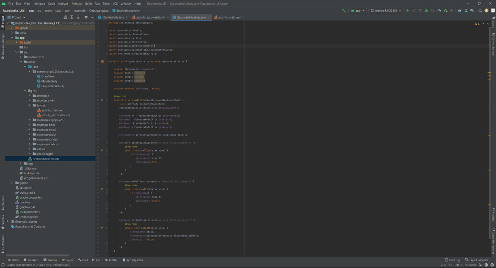

*Рисунок 10. Код StopwatchActivity.java*

 

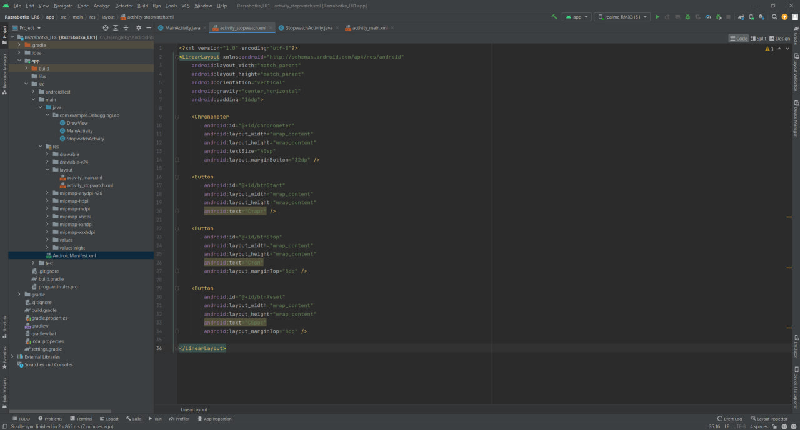

*Рисунок 11. Код activity_stopwatch.xml*

 

Код MainActivity.java:

<pre>
package com.example.DebuggingLab;

import android.content.Intent;
import android.os.Bundle;
import android.util.Log;
import android.view.View;
import android.widget.Button;
import android.widget.TextView;
import com.example.razrabotka_lr1.R;
import androidx.appcompat.app.AppCompatActivity;

import java.util.Timer;
import java.util.TimerTask;

public class MainActivity extends AppCompatActivity {

    private static final String TAG = "MainActivity";

    private TextView tvTimer;
    private Button btnStartTimer;
    private Button btnOpenStopwatch;

    @Override
    protected void onCreate(Bundle savedInstanceState) {
        super.onCreate(savedInstanceState);
        setContentView(R.layout.activity_main);

        tvTimer = findViewById(R.id.tvTimer);
        btnStartTimer = findViewById(R.id.btnStartTimer);
        btnOpenStopwatch = findViewById(R.id.btnOpenStopwatch);

        btnStartTimer.setOnClickListener(new View.OnClickListener() {
            @Override
            public void onClick(View view) {
                startDelayedTask();
            }
        });

        btnOpenStopwatch.setOnClickListener(new View.OnClickListener() {
            @Override
            public void onClick(View view) {
                Intent intent = new Intent(MainActivity.this, StopwatchActivity.class);
                startActivity(intent);
            }
        });
    }

    private void startDelayedTask() {
        tvTimer.setText("Таймер запущен, ждём 5 секунд...");
        Log.i(TAG, "Таймер запущен");

        Timer timer = new Timer();

        TimerTask task = new TimerTask() {
            @Override
            public void run() {
                runOnUiThread(new Runnable() {
                    @Override
                    public void run() {
                        tvTimer.setText("Прошло 5 секунд!");
                        Log.i(TAG, "Таймер сработал");
                    }
                });
            }
        };

        timer.schedule(task, 5000);
    }
}
</pre>

*Рисунок 12. Запуск приложения*

 

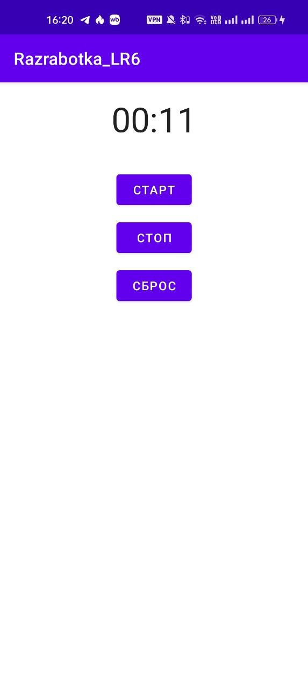

*Рисунок 13. результат в приложении*

 

## ИНДИВИДУАЛЬНОЕ ЗАДАНИЕ

Для выполнения индивидуального задания, возьму вариант №2: Последовательность Фибоначчи. Каждую секунду в течение минуты отображать следующий элемент последовательности Фибоначчи, начиная с 1.

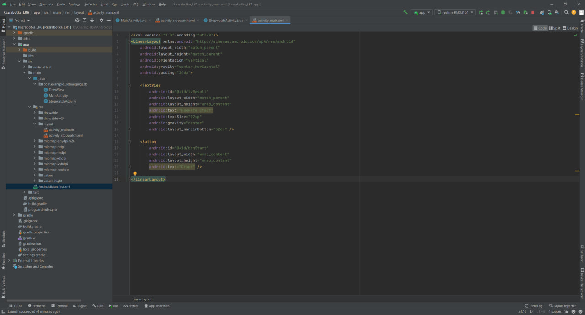

*Рисунок 14. Код activity_main.xml*

 

Код MainActivity.java:
<pre>
package com.example.DebuggingLab;

import android.os.Bundle;
import android.os.CountDownTimer;
import android.util.Log;
import android.view.View;
import android.widget.Button;
import android.widget.TextView;

import androidx.appcompat.app.AppCompatActivity;

import com.example.razrabotka_lr1.R;

public class MainActivity extends AppCompatActivity {

    private static final String TAG = "Lab6";

    private TextView tvResult;
    private Button btnStart;

    private CountDownTimer timer;

    private long previousNumber = 0;
    private long currentNumber = 1;
    private int second = 1;

    @Override
    protected void onCreate(Bundle savedInstanceState) {
        super.onCreate(savedInstanceState);
        setContentView(R.layout.activity_main);

        tvResult = findViewById(R.id.tvResult);
        btnStart = findViewById(R.id.btnStart);

        btnStart.setOnClickListener(new View.OnClickListener() {
            @Override
            public void onClick(View view) {
                startFibonacciTimer();
            }
        });
    }

    private void startFibonacciTimer() {
        previousNumber = 0;
        currentNumber = 1;
        second = 1;

        btnStart.setEnabled(false);
        tvResult.setText("Таймер запущен");

        Log.i(TAG, "Запуск вычисления последовательности Фибоначчи");

        timer = new CountDownTimer(60000, 1000) {
            @Override
            public void onTick(long millisUntilFinished) {
                long fibonacciNumber = currentNumber;

                String message = "Секунда " + second + ": число Фибоначчи = " + fibonacciNumber;

                tvResult.setText(message);
                Log.i(TAG, message);

                long nextNumber = previousNumber + currentNumber;
                previousNumber = currentNumber;
                currentNumber = nextNumber;

                second++;
            }

            @Override
            public void onFinish() {
                String message = "Вычисление завершено. Прошла 1 минута.";

                tvResult.setText(message);
                Log.i(TAG, message);

                btnStart.setEnabled(true);
            }
        };

        timer.start();
    }

    @Override
    protected void onDestroy() {
        super.onDestroy();

        if (timer != null) {
            timer.cancel();
            Log.i(TAG, "Таймер остановлен");
        }
    }
}
</pre>

Просмотрим результат, запустив приложение:

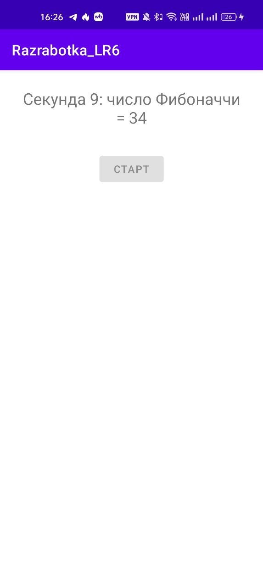

*Рисунок 15. Результат в приложении*

 

Просмотрим вывод результатов в Logcat:

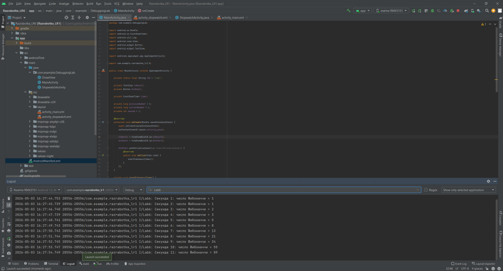

*Рисунок 16. Вывод результатов в Logcat*

 

### Вывод
В ходе практической работы были изучены основные инструменты отладки Android-приложений. Был использован Logcat для вывода и фильтрации сообщений разных уровней логирования. Также были рассмотрены точки останова для пошаговой отладки кода. В приложении были применены таймеры Timer, CountDownTimer и компонент Chronometer для выполнения отложенных и периодических задач, а также для реализации секундомера.
### Ответы на контрольные вопросы
1.  **Вопрос 1: Какие уровни логирования существуют в Android? Для каких целей используется каждый из них?** 
В Android существуют уровни логирования Verbose, Debug, Info, Warning и Error. Verbose используется для самой подробной информации, Debug — для отладки, Info — для обычных сообщений о работе приложения, Warning — для предупреждений, а Error — для ошибок.
2.  **Вопрос 2: Как открыть окно Logcat в Android Studio? Как отфильтровать сообщения только по тегу и только по уровню Error?**
Окно Logcat открывается через View → Tool Windows → Logcat. Чтобы отфильтровать сообщения по тегу, нужно ввести тег, например MainActivity или Lab6, в строку поиска. Чтобы показать только ошибки, нужно выбрать уровень Error.
3.  **Вопрос 3: В чем разница между методами Log.e() и Log.w()? Приведите примеры использования.**
Log.w() используется для предупреждений, когда есть потенциальная проблема, но приложение ещё работает нормально. Log.e() используется для ошибок. Например, Log.w(TAG, "Предупреждение") и Log.e(TAG, "Ошибка").
4. **Вопрос 4: Что такое точка останова (breakpoint)? Как запустить приложение в режиме отладки?**
Точка останова — это место в коде, где выполнение программы временно останавливается во время отладки. Чтобы запустить приложение в режиме отладки, нужно нажать кнопку Debug с зелёным жучком.
5. **Вопрос 5: Как выполнить код с задержкой в Android? Назовите не менее двух способов.** 
Код с задержкой в Android можно выполнить с помощью Timer и TimerTask, Handler.postDelayed() или CountDownTimer.
6. **Вопрос 6: В чем проблема обновления UI из задачи, выполняемой в TimerTask? Как её решить?** 
Проблема в том, что TimerTask выполняется в фоновом потоке, а изменять интерфейс можно только из UI-потока. Решить это можно с помощью runOnUiThread() или Handler.
7. **Вопрос 7: Для чего используется класс Chronometer? Какие основные методы у него есть?** 
Chronometer используется для создания секундомера. Основные методы: setBase(), start(), stop() и setFormat().
8. **Вопрос 8: Чем CountDownTimer отличается от Timer? В каких случаях удобнее использовать CountDownTimer?** 
Timer — это общий инструмент для выполнения задач с задержкой или периодически, а CountDownTimer удобен для обратного отсчёта. CountDownTimer лучше использовать, когда нужно выполнять действие через равные интервалы и завершить его через заданное время.
